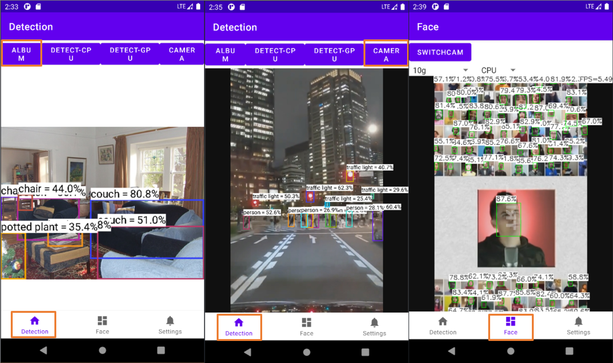
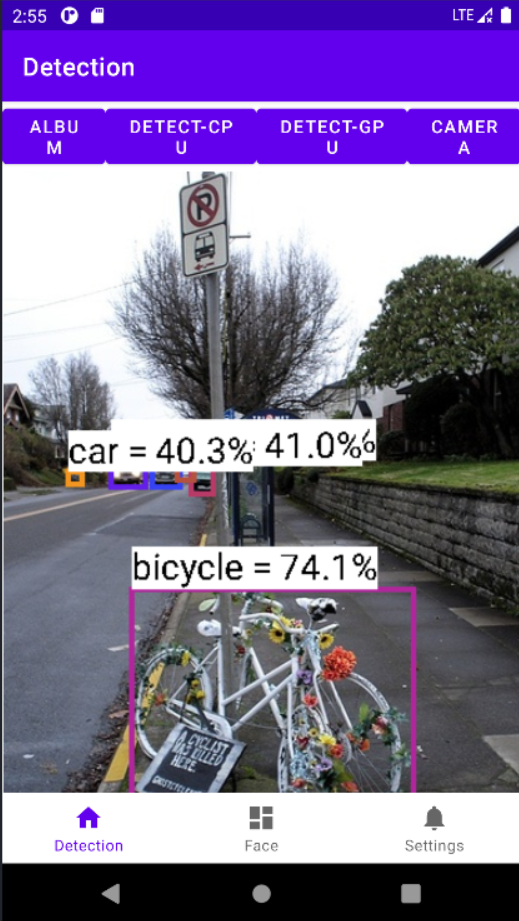

# Android Visual Detection Project

## Introduction

This is an Android Application aimed to make your community safer by implementing the SOTA deep neural network onto `x86_64` or `arm` architecture. The application has two functions up to now, i.e. Object Detection via YOLOv5, and Facial Recognition via ScrFD. 

----

### Object Detection

Once you launch the application, you'll see the main page of object detection. Firstly, you need to put a picture onto the canvas to let the algorithm to detect it. You can either press `album` button to select a photo from the system album, or press the camera `button` to take a new picture with your device's camera. As soon as the photo shows up on the page, you can then press the `detect` button to detect the object on your selected picture. 

----

As for the face recognition module, just enter the second page and you'll see the video captured by your front or back camera, the algorithm detects faces in the picture automatically. 

---

> This project was done by myself during my Applied Machine Learning SDE internship at Lenovo, the application is still looking forward to updates currently. 

## Technical Details

### Neural Network Backbone

- Object Detection: YOLOv5
- Facial Recognition: ScrFD

### Framework

Tencent ncnn